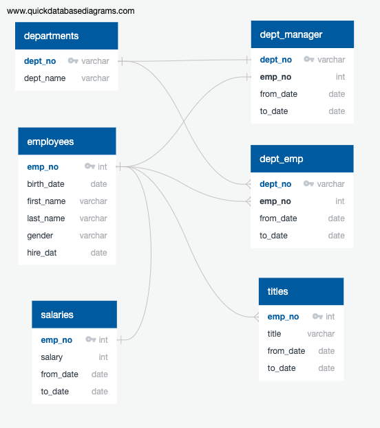
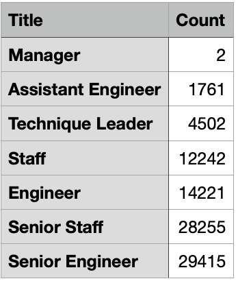
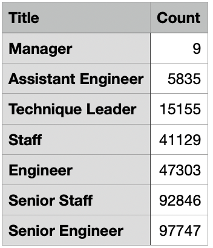

# Pewlett-Hackard-Analysis
   ## Bootcamp Module 7
It was recently discovered that Pewlett-Hackard has a very large number of employees about to retire.  41,381 retirement-ready employees may soon leave the company in a “silver tsunami”, resulting in not only a loss of employees, but a loss of a huge knowledge-base as well.  The development of a mentorship program will allow us to identify & pair a seasoned employee with a less-tenured one to pass the knowledge + experience to the next generation.

+   Data was available in six different datasets:  *Employees, Salaries, Departments, Department Managers, Department Employees,* and *Titles.*  
+   I utilized an Entity Relationship Diagram (ERD) to visually map the relationships between the data before building the relationships:

Schema used for creating the tables: [schema.sql](Analysys_Projects_Folder/Pewlett-Hackard-Analysis_Folder/Queries/schema.sql)

**TITLES RETIRING**

I counted the total number of titles retiring by choosing employees born between 1952-1955. The table created is included in the same .sql file as the count, and the employee list is in the .csv 
+   Information from the:
+   *employees, salaries,* and *titles* data tables were combined, and I partitioned the results to show only the most recent titles.

Number of titles retiring:

Table = [ret_recent_title.sql](Analysys_Projects_Folder/Pewlett-Hackard-Analysis_Folder/Queries/ret_recent_title.sql)

Data = [ret_title_count.csv](Analysys_Projects_Folder/Pewlett-Hackard-Analysis_Folder/Data/ret_title_count.csv), 
    [ret_recent_title.csv](Analysys_Projects_Folder/Pewlett-Hackard-Analysis_Folder/Data/ret_recent_title.csv)

**TOTAL EMPLOYEES WITH EACH TITLE**

Table = [all_emp_titles.sql](Analysys_Projects_Folder/Pewlett-Hackard-Analysis_Folder/Queries/all_emp_titles.sql)  

Data =  [all_recent_title.csv](Analysys_Projects_Folder/Pewlett-Hackard-Analysis_Folder/Data/all_recent_title.csv),  [all_title_count.csv](Analysys_Projects_Folder/Pewlett-Hackard-Analysis_Folder/Data/all_title_count.csv)

Next, I determined the total number of active employees eligible for mentoring using employees with birth dates in 1965.  Active employees were determined by using ‘9999-01-01’ as the “to_date”.  This produces 1,549 employees eligible for the first trial of the employee mentorship program:

Table = [mentor_eligible.sql](Analysys_Projects_Folder/Pewlett-Hackard-Analysis_Folder/Queries/mentor_eligible.sql)

Data = [mentor_eligible.csv](Analysys_Projects_Folder/Pewlett-Hackard-Analysis_Folder/Data/mentor_eligible.csv)

Currently, there are 300,024 active employees at Pewlett-Hackard, with 57,670 (19.22%) ready to retire.  1,549 current employees have been identified for the initial trial of a mentor program.  While we have raw numbers of retirement-ready employees ready for the mentor program, there is a huge mis-match in numbers.  Further analysis of performance reviews, areas of expertise, and working environment need to be considered when choosing the correct mentors.

